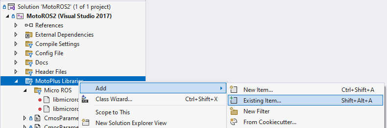
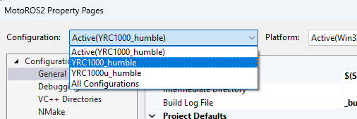
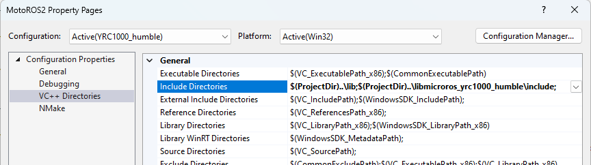
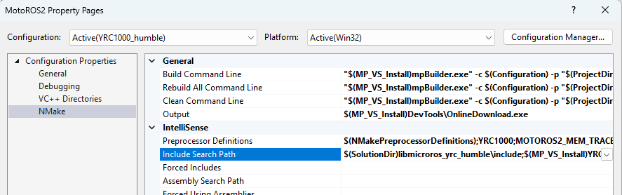
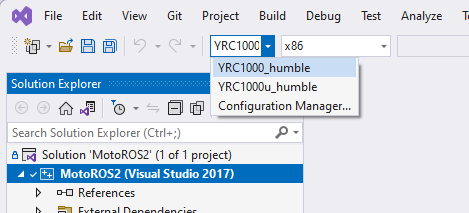

<!--
SPDX-FileCopyrightText: 2023, Yaskawa America, Inc.
SPDX-FileCopyrightText: 2023, Delft University of Technology

SPDX-License-Identifier: CC-BY-SA-4.0
-->

# Building from source code

Users may want to make changes to the behavior and feature-set of MotoROS2.
To do this, it is necessary to build the MotoROS2 project from source code.

Please note that building from source code is *not* required for normal usage of MotoROS2.
It is only required when you want to change the included functionality.

## Requirements

- **Microsoft Windows**
- **Microsoft Visual Studio 2017 or higher** (the *Community Edition* is also known to work).
The MotoPlus SDK is not compatible with Visual Studio Code.
- **MotoPlus SDK for Visual Studio v1.5.1 or higher**.
This is not the same as MotoPlus IDE. Users in Asian regions will need to purchase this software from [Yaskawa America directly](https://www.motoman.com/en-us/products/robots/sales-quote).
If you already have a license for an older version of the MotoPlus SDK, please contact `techsupport@motoman.com` or `ccs@yaskawa.eu` for assistance obtaining a newer edition.
- **libmicroros library and headers** that corresponds to your target edition of ROS 2 (Humble, Jazzy, etc) and the Yaskawa controller series you are building MotoROS2 for
Although `libmicroros` as used by MotoROS2 is derived from the open-source [micro-ROS](https://micro.ros.org) project, various patches were needed to make it compatible with MotoPlus. As of writing, these patches can not be made open-source yet. Because of this, we distribute the `libmicroros` dependency as a closed-source library.
These can be found on the [micro_ros_motoplus/Releases](https://github.com/yaskawa-global/micro_ros_motoplus/releases) page.

## Setup

Clone the [yaskawa-global/motoros2](https://github.com/yaskawa-global/motoros2.git) repository.

Obtain the `libmicroros` and headers for your target ROS 2 variant and controller series.

These are provided as separate downloads and can be found on the [micro_ros_motoplus/Releases](https://github.com/yaskawa-global/micro_ros_motoplus/releases) page.

When downloading `libmicroros` from the repo, the folder will be named with a unique identifier corresponding to the time stamp of the build.
Rename the folder to `libmicroros_<controller-series>_<ros-2-variant>`.
E.g. `libmicroros_yrc1000_jazzy`.

Move the folder containing `libmicroros` and the headers inside the folder with the Visual Studio solution (ie: `MotoROS2.sln`).

Example showing where `libmicroros_yrc1000_jazzy` should be moved for a Jazzy build of MotoROS2 targetting a YRC1000 controller:

```text
motoros2
|-- libmicroros_yrc1000_jazzy
|   |-- include
|   |   `-- ...
|   |-- build_info.yaml
|   `-- libmicroros.yrcLib_jazzy
|-- src
|   |-- ...
|   `-- MotoROS2_AllControllers.vcxproj
|-- ...
`-- MotoROS2.sln
```

Now open `MotoROS2.sln` in Visual Studio.

## Verify project configuration

The *Configuration Manager* dropdown should be pre-populated with the supported combinations of controller models and ROS 2 variants.
If it is not, you will need to add them manually.
This procedure will also allow you to verify the Visual Studio project configuration is correct.

1. In the project tree, expand the `MotoPlus Libraries` > `micro-ROS` folder.
   Check for the `libmicroros` library that was obtained in the `Setup` procedure above.

   If is is not in the project tree, right-click the `MotoPlus Libraries` folder in the project tree and select `Add` > `Existing Item`.

   

   Navigate to the `libmicroros` library file and add it to the project.

1. In the top menu, choose `Project` > `Properties`.
   Use the `Configuration` dropdown to choose the correct configuration for your robot controller model and ROS 2 variant.

   

   Choose `VC++ Directories` from the left tree view.
   Verify the path to `libmicroros` headers exists in the `Include Directories` field.
   This can be a relative path, using MSBuild macros.
   Copy this path, as it will be used again in the next step.

   Example: `$(ProjectDir)..\libmicroros_yrc1000_jazzy\include;`
   NOTE: Do not use the `$(SolutionDir)` macro in this step.
   The path should be either relative to the project file or absolute.

   

1. Choose `NMake` from the left tree view.
   Ensure the start of the `Include Search Path` includes the path to the `libmicroros` headers.
   Example: `$(ProjectDir)..\libmicroros_yrc1000_jazzy\include;`

   

   Click `OK` to close the properties dialog.

   Repeat these setup instructions for each controller model and ROS 2 variant that you wwant to build MotoROS2 for.

## Building

Use the *Configuration Manager* dropdown to select your target controller model and ROS 2 variant.



From the main menu, navigate to `Build` > `Build MotoROS2` to build the project.

Alternatively, if you are targeting multiple configurations, navigate to `Build` > `Batch Build`.
Check each configuration that you are targeting and then click `Build`.
