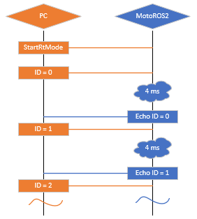

<!--
SPDX-FileCopyrightText: 2025, Yaskawa America, Inc.
SPDX-FileCopyrightText: 2025, Delft University of Technology

SPDX-License-Identifier: CC-BY-SA-4.0
-->

# R/T Motion Control

The real-time motion control server is intended to be used in a closed loop system.
It allows the user to command incremental offsets at the rate of the robot controller's interpolation clock.
This control mode minimizes overhead as much as possible by routing the user commands directly to the MotoPlus motion API, mpExRcsIncrementMove.

## Activation

This control mode is activated using the [start_rt_mode](ros_api.md#start_rt_mode) service.
The user must specify the `control_mode` to indicate whether the increments will be joint offsets (radians) or cartesian TCP offsets (meters / radians).

If this service is successful, it will return a `result_code` of `Ready (1)`.
Otherwise, please examine the `result_code` and `message` files in the response for more information.

The service will also return a `period` in milliseconds.
This indicates the rate at which increment commands will be expected by the robot.
The default period for a single manipulator is 4 milliseconds.
However, that value will increase as additional axes or manipulators are added to the system.

## Usage

### Command Flow

Once activated, a UDP server will listen on port `22000` (default).
The user then sends the first increment with a the `sequenceId` field set to `0`.
After that, the user must wait until the robot replies before sending the next increment.
Each subsequent command must increment the `sequenceId`. Additionally, each subsequent command must not be sent until the robot replies to the previous command.
This will occur at the rate of the `period` from the [start_rt_mode](ros_api.md#start_rt_mode) service.

If a command is not received with 30 seconds (default), then the session times out and is dropped.
At that point, the server must be reactivated by calling `stop_traj_mode` and `start_rt_mode`.
A "keep-alive" can be used by sending a command with zero increments.

Additionally, if the client does not receive a reply packet within this amount of time, then it should be assumed that the session is dead.



### Data format (command)

The command packet is a *packed* `RtPacket` structure.

```c
//##########################################################################
//                  !All data is little-endian!
//##########################################################################
struct RtPacket
{
    int version;

    UINT32 sequenceId;
    double delta[MAX_GROUPS][MAX_AXES]; //[8][8]
    int toolIndex[MAX_GROUPS]; //[8]
}
```

The `version` must match the version number expected by the server.
If it does not match the expected value, the packet will be rejected and the connection will be dropped.
The current version is `1`.

This contains a sequence ID, the increments for each control group, and the tool number to use for each control group.

#### Joints

When the `control_mode` is `JOINT_ANGLES (1)`, the order of the joints in the `delta` array must be in the order of `S L U R B T E 8`.
Please note that for seven axis robots, the `E` joint is phyically mounted in the middle of the arm.
But it must be sent at the end of the joint array.

See `JointIndices` enum.

```c
enum JointIndices
{
    Joint_S = 0,    //radians
    Joint_L,
    Joint_U,
    Joint_R,
    Joint_B,
    Joint_T,
    Joint_E,
    Joint_8,

    MAX_JOINTS
}
```

#### Cartesian

When the `control_mode` is `CARTESIAN (2)`, the order of the joints in the `delta` array must be in order of `X Y Z Rx Ry Rz Re 8`.

See `CartesianIndices` enum.

```c
enum CartesianIndices
{
    TCP_X = 0,      //meters
    TCP_Y,
    TCP_Z,

    TCP_Rx,         //radians
    TCP_Ry,
    TCP_Rz,
    TCP_Re,

    TCP_8,          //pulse

    MAX_AXES
}
```

Please note that rotations are applied in the order of `Z Y X`.

### Data format (reply)

The command packet is a *packed* `RtReply` structure.
This will echo the sequence ID, provide feedback position, and provide commanded position.

Additionally, there is a flag to indicate if the Functional Safety Unit (FSU) reduced the speed of the **previous** command cycle.
This indicates that the robot did not complete the full increment as commanded.

```c
//##########################################################################
//                  !All data is little-endian!
//##########################################################################
struct RtReply
{
    UINT32 sequenceEcho;
    
    double feedbackPositionJoints[MAX_GROUPS][MAX_JOINTS]; //[8][8]
    double feedbackPositionCartesian[MAX_GROUPS][MAX_JOINTS]; //[8][8]

    double previousCommandPositionJoints[MAX_GROUPS][MAX_AXES]; //[8][8]
    double previousCommandPositionCartesian[MAX_GROUPS][MAX_AXES]; //[8][8]

    bool fsuInterferenceDetected;
}
```

## Deactivation

Other motion modes may not be used at the same time as the real-time motion control server.
The service to start those modes will fail when invoked.
By calling `stop_traj_mode`, the R/T server will be disposed.
At that time, another motion mode may be used.
