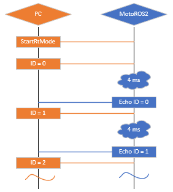

<!--
SPDX-FileCopyrightText: 2025, Yaskawa America, Inc.
SPDX-FileCopyrightText: 2025, Delft University of Technology

SPDX-License-Identifier: CC-BY-SA-4.0
-->

# R/T Motion Control

The real-time motion control server is intended to be used in a closed loop system.
It allows the user to command incremental offsets at the rate of the robot controller's interpolation clock.
This control mode minimizes overhead as much as possible by routing the user commands directly to the MotoPlus motion API, mpExRcsIncrementMove.

## Activation

This control mode is activated using the [start_rt_mode](ros_api.md#start_rt_mode) service.
The user must specify the `control_mode` to indicate whether the increments will be joint offsets (radians) or cartesian TCP offsets (meters / radians).

If this service is successful, it will return a `result_code` of `Ready (1)`.
Otherwise, please examine the `result_code` and `message` files in the response for more information.

The service will also return a `period` in milliseconds.
This indicates the rate at which increment commands will be expected by the robot.
The default period for a single manipulator is 4 milliseconds.
However, that value will increase as additional axes or manipulators are added to the system.

## Usage

### Command Flow

Once activated, a UDP server will listen on port `22000` (default).
The user then sends the first increment with a the `sequenceId` field set to `0`.
After that, the user must wait until the robot replies before sending the next increment.
Each subsequent command must increment the `sequenceId`. Additionally, each subsequent command must not be sent until the robot replies to the previous command.
This will occur at the rate of the `period` from the [start_rt_mode](ros_api.md#start_rt_mode) service.

If a command is not received with 5 seconds (default), then the session times out and is dropped.
At that point, the server must be reactivated by calling `stop_traj_mode` and `start_rt_mode`.
A "keep-alive" can be used by sending a command with zero increments.

Additionally, if the client does not receive a reply packet within this amount of time, then it should be assumed that the session is dead.



### Data format (command)

The command packet is a *packed* `RtPacket` structure.

```c
//##########################################################################
//                  !All data is little-endian!
//##########################################################################
struct RtPacket
{
    //The version of the command packet must match the value expected
    //by MotoROS2.

    int version;

    //The packet type must match the control_mode which was specified
    //in when invoking the start_rt_mode service.

    PacketType packetType;

    //Must increment sequentially with each new command packet.

    UINT32 sequenceId;
    
    //The order of the joints must be in the order of [S L U R B T E 8].
    //Please note that for seven axis robots, the 'E' joint is phyically
    //mounted in the middle of the arm. But it must be sent at the end
    //of the joint array. See JointIndices enum.
    //
    //For joint-space, this will be radians of each joint.
    //
    //For cartesian, this will be meters and radians of the TCP.
    //The order of the joints must be in the order of [X Y Z Rx Ry Rz Re 8].
    //See CartesianIndices enum.
    //Rotations are applied in the order of ZYX.

    double delta[MAX_GROUPS][MP_GRP_AXES_NUM];
    
    //Set tool that will be used by motion API (ie: passed by us to mpExRcsIncrementMove(..))
    //NOTE: this will change the 'motion tool' ONLY for those increments which
    //      haven't yet been added to the increment queue. See also the ROS 2
    //      'select_tool' service definition file in motoros2_interfaces.

    int toolIndex[MAX_GROUPS]; //TOOL 0 - 63

    //Reserved for future expansion

    char reserved[64];
}
```

The `version` must match the version number expected by the server.
If it does not match the expected value, the packet will be rejected and the connection will be dropped.
The current version is `1`.

#### Joints

When the `control_mode` is `JOINT_ANGLES (1)`, the order of the joints in the `delta` array must be in the order of `S L U R B T E 8`.
Please note that for seven axis robots, the `E` joint is phyically mounted in the middle of the arm.
But it must be sent at the end of the joint array.

See `JointIndices` enum.

```c
enum JointIndices
{
    Joint_S = 0,    //radians
    Joint_L,
    Joint_U,
    Joint_R,
    Joint_B,
    Joint_T,
    Joint_E,
    Joint_8,

    MAX_JOINTS
}
```

#### Cartesian

When the `control_mode` is `CARTESIAN (2)`, the order of the joints in the `delta` array must be in order of `X Y Z Rx Ry Rz Re 8`.

See `CartesianIndices` enum.

```c
enum CartesianIndices
{
    TCP_X = 0,      //meters
    TCP_Y,
    TCP_Z,

    TCP_Rx,         //radians
    TCP_Ry,
    TCP_Rz,
    TCP_Re,

    TCP_8,          //pulse

    MAX_AXES
}
```

Please note that rotations are applied in the order of `Z Y X`.

### Data format (reply)

The command packet is a *packed* `RtReply` structure.
This will echo the sequence ID, provide feedback position, and provide commanded position.

Additionally, there is a flag to indicate if the Functional Safety Unit (FSU) reduced the speed of the **previous** command cycle.
This indicates that the robot did not complete the full increment as commanded.

```c
//##########################################################################
//                  !All data is little-endian!
//##########################################################################
struct RtReply
{
    UINT32 sequenceEcho;

    //This is indicative of where the robot is physically located.
    //Please note that this will trail behind the commanded position.
    //The joint ordering will match that of the original command
    //packet. See JointIndices and CartesianIndices enums.

    double feedbackPositionJoints[MAX_GROUPS][MP_GRP_AXES_NUM];
    double feedbackPositionCartesian[MAX_GROUPS][MP_GRP_AXES_NUM];

    //The command position is the target destination you are instructing
    //the robot to reach. It's the calculated endpoint based on the sum
    //of all position increments received from the user.
    //
    //This is used to track if the robot's speed is being limited
    //by the Functional Safety Unit (FSU). It can also be used to
    //monitor the latency between command and feedback.

    double previousCommandPositionJoints[MAX_GROUPS][MP_GRP_AXES_NUM];
    double previousCommandPositionCartesian[MAX_GROUPS][MP_GRP_AXES_NUM];

    //If the FSU speed limit is enabled, it can truncate the commanded
    //delta increments. This flag is an indicator that the *previous*
    //command cycle was truncated. It does NOT indicate that this most
    //recent command packet was truncated.

    bool fsuInterferenceDetected;
}
```

## Deactivation

Other motion modes may not be used at the same time as the real-time motion control server.
The service to start those modes will fail when invoked.
By calling `stop_traj_mode`, the R/T server will be disposed.
At that time, another motion mode may be used.

# R/T Status Monitoring

When the R/T Motion Control is activated, MotoROS2 will begin to send the `RobotState` structure on port UDP `22001` (default).
This is essentially a clone of the `/robot_status topic`.
But decoupled from the `industrial_msgs/RobotStatus` type.

```
struct RobotState
{
    BOOL drives_powered;
    BOOL e_stopped;
    BOOL in_motion;
    BOOL play_mode;
    BOOL motion_possible;
    BOOL error;
    int error_code;
}
```

This will be sent every `rt_status_sleep_period` milliseconds.
